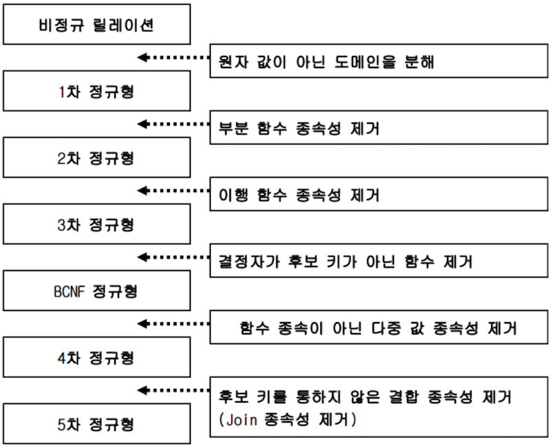
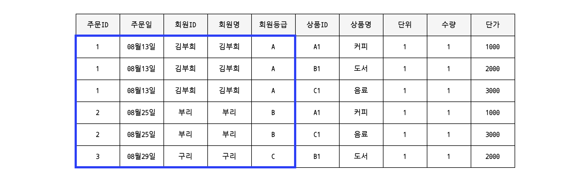
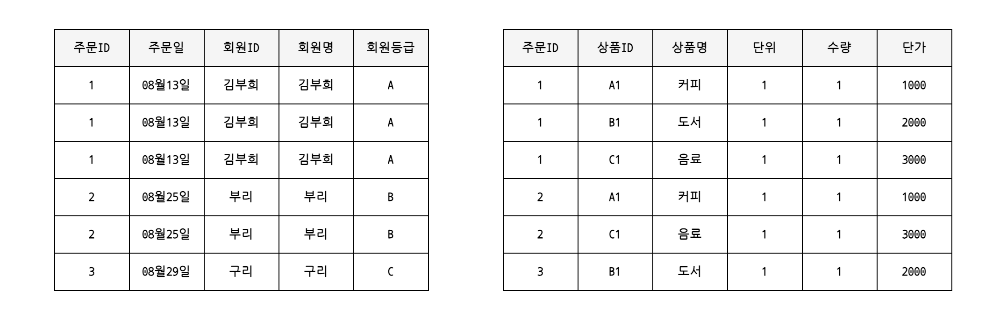

# 8장 데이터베이스 설계 

<br/>

## # 데이터베이스 설계

#

### # 데이터베이스 설계 

> 데이터베이스 설계 : 테이터베이스의 스키마 내에 테이블, 인덱스, 뷰 등 데이터베이스 객체를 정의
>
> 스키마 설계 : 스키마 내에 정의

- 테이블의 이름이나 열, 자료형을 결정
- '이 테이블은 이 열을 이용해 저 쪽 테이블과 연결' ➡️ 테이블 관계 생각

#### - 논리명과 물리명 
> 물리명 : 데이터베이스에서 사용될 이름, CREATE TABLE 에 지정하는 이름
>
> 논리명 : 테이블의 '설계상 이름'

- **물리명**은 전통적으로 알파벳을 사용하며, 데이터베이스 시스템 규칙에 따라 길이에 제한이 있거나 공백문자를 사용 불가
- 물리명만으로 의미가 전달되지 않아 해당 테이블을 실제로 부를 때 사용하는 **논리명** 필요 

#### - 자료형 

> 수치형, 문자열형 등 테이터의 내용에 맞게 자료형 지정 

- 데이터베이스 기능인 제약(CHECK 제약)으로 데이터 정합성을 확인할 수 있음
  - 데이터 정합성❓ - 서로 모순이 없이 일관되게 일치해야 한다는 의미, 데이터 값이 각각 일치해야한다는 뜻
  - 데이터 정합성에 어긋난다 = 데이터가 일치하지 않는다

#### - 고정길이와 가변길이

> 저장할 데이터를 고려하여 문자열의 자료형을 고정길이와 가변길이로 결정

- **고정길이** : 자리수가 이미 정해져 있는 경우
- **가변길이** : 입력되는 문자열의 길이의 변동폭이 클 경우 
  - 큰 데이터는 LOB 형으로 지정

#### - 기본키

> 자동증가 열을 사용하여 기본키로 지정할 수 있음 

- MySQL의 경우 `AUTO_INCREMENT` 를 지정 → 자동증가열 

#

### # ER다이어그램 

> 테이블을 설계할 때 테이블 간의 관계를 명확히 하기 위한 설계도
>
> E(Entity)R(Relationdhip) : 개체 간의 관계 표현

- ER 다이어그램에서 개체는 `사각형`으로 표현
  - **개체 : 엔티티 (테이블 또는 뷰)**
- 사각형 안에는 개체의 속성 표기 
  - **속성 : 테이블의 열**
- 개체와 개체가 서로 연계되는 경우` 선`으로 이어서 표현
  - 연계를 표기할 때 서로 몇 개의 데이터 행과 연관되는지, 즉 몇 대 몇의 관계를  가지는 지 표현
  - 일대일, 일대다, 다대다
  - 데이터베이스에서는 **외부참조제약(외부키 제약)** 으로 지정되는 경우 존재 

<br/>


## # 정규화

> 속성 간에 존재하는 함수적 종속성을 분석하여 관계형 스키마를 더 좋은 구조로 정제해 나가는 일련의 과정
>
> 데이터의 중복을 제거하고 속성들을 본래의 제자리에 위치시키는 것 



<br/>

---



##### # 제 1정규형 

- 하나의 셀에 하나의 값만 저장할 수 있도록 하고, 반복되는 데이터를 세로(행 방향)로 늘리는 것
- 반복되는 그룹 속성을 제거한 뒤 기본 테이블의 기본키를 추가해 새로운 테이블을 생성하고 기존의 테이블과 1:N의 관계를 형성하는 과정
  - 반복되는 그룹의 속성이란? 같은 성격과 내용의 컬럼이 연속적으로 나타나는 컬럼을 말함.



##### # 제 2정규형 

- 데이터가 중복하는 부분을 찾아내어 테이블로 분할 
  - 기본키에 의해 특정되는 열과 그렇지 않은 열로 나누어 정규화
- 복합키에 전체적으로 의존하지 않는 속성 제거 (부분 함수종속성을 찾아내서 테이블 분할)
  - 복합키의 일부분에 의해 종속되는 것을 **부분적 함수 종속관계**라고 함
  - 함수종속성 : 키 값을 이용해 데이터를 특정 지울 수 있는 것


##### # 제 3정규형 

- 기본키에 의존하지 않고 일반 컬럼에 의존하는 컬럼들을 제거 
  - 이행적 함수 종속관계를 갖는 컬럼을 제거하는 과정
- 기본키 이외의 부분에서 중복이 없는지 조사하여 분할

 → 분할할 때는 서로 결합할 수 있도록 **기본키**를 추가해 분할


#

#### # 정규화의 목적

> 중복하거나 반복되는 부분을 찾아내서 테이블을 분할하고 기본키를 작성해 사용하는 것
>
> 정규화로 데이터 구조를 개전하는 것은 하나의 데이터가 한 곳에 저장되도록 하기 위함이다‼️

- 하나의 데이터가 반드시 한 곳에만 저장되어 있다면 데이터를 변경하더라도 한 곳만 변경하면 됨
- 정규화를 통해 테이블에 대한 인덱스의 재구축을 억제할 수 있음 

<br/>

## # 트랜잭션

#

### # 트랜잭션  & 롤백 & 커밋

> 테이블 내용을 변경하는 SQL들이 연달아 실행되며, 이것들이 마치 하나의 SQL처럼 다 같이 성공하던지 아니면 실패해야 한다면 트랜잭션의 사용이 필수!

```sql
START TRANSACTION (BEGIN)
COMMIT (END)
ROLLBACK
```

- 트랜잭션을 사용하여 데이터를 **추가, 수정, 삭제**한 경우 에러가 발생해도 트랜잭션을 **롤백**해서 종료할 수 ⭕️
- 롤백하면 트랜잭션 내에서 행해진 모든 변경사항이 적용되지 ❌
- 아무런 에러가 발생하지 않는다면 변경사항을 적용하고 트랜잭션을 종료하는 **커밋** 사용

#### # 자동커밋

- MySQL 에서는 자동커밋이 켜져 있기 때문에 트랜잭션을 사용하기 위해서는 자동커밋을 꺼야한다.
- 자동커밋을 끄기 위해서는 명시적으로 트랜잭션 시작인  `START TRANSACTION` 명령 사용

- 트랜잭션 종료하기 위한 방법
  - 변경된 내용을 적용한 후에 종료하는 **커밋** :  `COMMIT`
  - 변경된 내용을 적용하지 않고 종료하는 **롤백** : `ROLLBACK`

- 트랜잭션 내에서 실행된 SQL 명령은 임시 데이터 영역에서 수행되다가, COMMIT 명령을 내리면 임시 데이터 영역에서 정식 데이터 영역으로 변경이 적용 ROLLBACK 명령을 내리면 임시 데이터 영역에서의 처리는 버려진다.

#

### # 트랙잭션 사용법 

>  세트로 실행하고 싶은 SQL 명령을 트랜잭션에서 하나로 묶어 실행

- 앞서 ROLLBACK 은 에러가 발생한 경우 변경사항이 적용되지 않도록 하는 목적으로 주로 사용
- 하지만, 에러가 발생하지 않아도 ROLLBACK을 하면 변경한 내용은 파기
- 에러가 발생하더라고 COMMIT을 하면 문제없이 실행된 SQL 명령의 변경사항은 데이터베이스에 그대로 반영 


